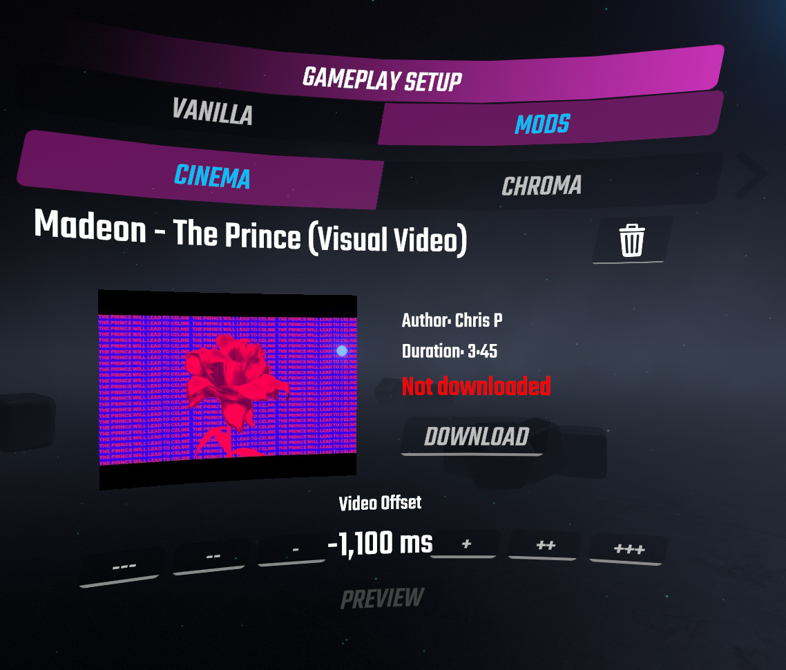

## BeatSaberCinema

A Beat Saber plugin that allows you to sync up videos to play alongside your maps, heavily inspired by MusicVideoPlayer. Made by Dakari#0638

### How to use

The plugin includes more than 30 video configurations for you to try. You can download some of the pre-configured levels, a selection of which you can find below:

- [Madeon - The Prince \[Bearly & dgrj4life\]](https://beatsaver.com/beatmap/110ac)
- [2WEI feat. Edda Hayes - Warriors \[halcyon12\]](https://beatsaver.com/beatmap/8e98)
- [Reol - Utena \[ETAN\]](https://beatsaver.com/beatmap/abc4)
- [JVNA - Catch Me \[nitronik.exe\]](https://beatsaver.com/beatmap/bc4e)
- [Yorushika - Say It \[squeaksies\]](https://beatsaver.com/beatmap/4a21)
- [Dreamcatcher - Scream \[noxn; simplymarvellous; aggrogahu\]](https://beatsaver.com/beatmap/8d49)
- [K/DA - MORE \[DACK\]](https://beatsaver.com/beatmap/1059c)

After that, select a song in-game and to your left, select "Mods" from the menu. Look for the tab "Cinema", which should look like this:



Click download in the center of the menu and wait for the download to complete, then simply play the map. If the download takes too long for you, you can lower the video quality from the main menu settings.

You can of course add videos to any song you like, even if they are not pre-configured. The menu will in that case show you a button labeled "Search", which will lead you to the search results from YouTube. After you choose a video, you will have to adjust the video offset. To do so, simply click the "Preview" button to play the video, and use the "+" or "-" buttons to adjust the offset until the sound from both ears lines up. Sound from the video will play in your left ear. If the sound from the left ear is behind, click the "+" buttons, otherwise the "-" buttons until the sound from both ears lines up. The sync doesn't have to be exactly perfect though.

Cinema is also compatible with video configs created with MusicVideoPlayer. You can't however use both plugins at the same time. If MVP is installed as well, Cinema will not be enabled to avoid conflicts.

### Requirements

The following plugins are **required** for Cinema to work:

- BSIPA
- BeatSaberMarkupLanguage
- BS Utils
- CustomJSONData

You can find all of these in ModAssistant.

Additionally, this plugin **conflicts** with:

- MusicVideoPlayer

### JSON Format

*This section is intended for mappers*

The video configuration will be stored in the same folder as the map itself, in a file called **cinema-video.json**. If you are a mapper, you can include the json file in the zip you upload to BeatSaver. Editing the json file by hand allows you to modify some settings that are not available in-game, for example to create a custom screen placement. Cinema includes the ability to change any object in the game scene, to better fit the video screen.

Please note that currently you have to close the game before editing the json file, as otherwise the plugin will overwrite your changes. This may change in the future.

The following table lists the currently available configuration options:

| Property                   | Data Type | Default          | Required | Example | Description |
| -------------------------- |:---------:|:----------------:|:--------:| ------- | ----------- |
| `videoID`                  | `string`  | *none*           | **yes**  | _qwnHeMKbVA | The YouTube video ID from the URL, e.g.: `https://youtube.com/watch?v=_qwnHeMKbVA` |
| `title`                    | `string`  | Untitled Video   | no       | Madeon - The Prince (Visual Video) | The title of the video |
| `author`                   | `string`  | Unknown Author   | no       | Chris P | The name of the video's uploader |
| `duration`                 | `int`     | 0                | **yes**  | 225 | Video duration in **seconds** |
| `offset`                   | `int`     | 0                | **yes**  | -1100 | The offset in **milliseconds** to align the video with the map. Use the video menu in-game to determine the offset. |
| `formatVersion`            | `int`     | 1                | no       | 1 | The file format version. Always leave at the default. May be used in the future to convert older configs in case the format changes drastically. |
| `loop`                     | `bool`    | false            | no       | false | Whether the video should loop if it ends before the map does. |
| `configByMapper`           | `bool`    | false            | no       | false | Used to indicate whether the config was created by the mapper. May in the future be used to mark it as the "official" config. |
| `screenPosition`           | `Vector3` | `(0, 12.40, 68)` | no       | `{"x": 0.0,"y": 12.4,"z": 100.0}` | This setting can be used to create a custom positioning of the video player. **x** is the deviation from the center, **y** is up/down and **z** controls the distance. |
| `screenRotation`           | `Vector3` | `(352, 0, 0)`    | no       | `{"x": 352.0,"y": 0.0,"z": 0.0}` | Rotates the video screen. By default, it tilts down by 8 degrees for better visibility. |
| `screenHeight`             | `float`   | 25.0             | no       |  25.0 | Determines the size of the screen. There is no setting for the width, since that is calculated automatically by the height and the aspect ratio of the video. If you change the height, you might want to also change the **y** positioning of the screen so it doesn't float above the ground. |
| `disableBigMirrorOverride` | `bool`    | false            | no       | true | If set to `true`, will prevent the plugin from loading the Big Mirror environment, which works best for video configs without custom screen positioning. |

There is an additional property called `environment` which can be used to alter other objects in the game scene. More details on that coming soon.

Here is an example config that uses some of the more advanced settings, including `environemnt` modifications:

```
{
  "videoID": "_qwnHeMKbVA",
  "title": "Madeon - The Prince (Visual Video)",
  "author": "Chris P",
  "videoFile": "Madeon - The Prince (Visual Video).mp4",
  "duration": 225,
  "offset": -1100,
  "formatVersion": 1,
  "loop": false,
  "screenPosition": {
    "x": 0.0,
    "y": 12.4,
    "z": 100.0
  },
  "disableBigMirrorOverride": true,
  "environment": [
    {
      "name": "RocketArena",
      "active": false
    },
    {
      "name": "RocketGateLight",
      "position": {
        "x": 0.0,
        "y": -3.8,
        "z": 98.0
      },
      "scale": {
        "x": 3.5,
        "y": 1.0,
        "z": 4.8
      }
    }
  ]
}
```

### Special thanks

Special thanks go to:

- **Rolo**:
For creating MVP and helping me improve the looks of the video screen

- **rie-kumar** and **b-rad15**:
For keeping MVP alive across many game updates

- The **youtube-dl** and **ffmpeg** projects:
Used to download and convert the videos


