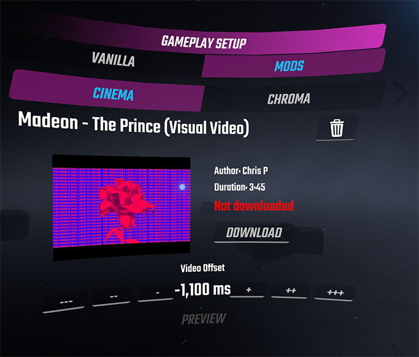

# BeatSaberCinema

A Beat Saber plugin that allows you to sync up videos to play alongside your maps, heavily inspired by MusicVideoPlayer. Made by Dakari#0638

## How to use

### 1. Installation
To install Cinema, download the latest release and simply unzip all of it's contents into the Beat Saber folder. Make sure you don't skip the files in the Libs folder, as those are required, too.

Additionally, the following plugins are **required** for Cinema to work:

- BSIPA
- BeatSaberMarkupLanguage
- BS Utils

You can find all of these in ModAssistant.

### 2. Download Pre-Configured Maps (*optional*)
The plugin includes more than 70 video configurations for you to try. For your convenience, here are a few examples:

- [Madeon - The Prince \[Bearly & dgrj4life\]](https://beatsaver.com/beatmap/110ac)
- [2WEI feat. Edda Hayes - Warriors \[halcyon12\]](https://beatsaver.com/beatmap/8e98)
- [Reol - Utena \[Pixelguy & Rayman\]](https://beatsaver.com/beatmap/b24b)
- [JVNA - Catch Me \[nitronik.exe\]](https://beatsaver.com/beatmap/bc4e)
- [Yorushika - Say It \[squeaksies\]](https://beatsaver.com/beatmap/4a21)
- [Dreamcatcher - Scream \[noxn; simplymarvellous; aggrogahu\]](https://beatsaver.com/beatmap/8d49)
- [K/DA - MORE \[DACK\]](https://beatsaver.com/beatmap/1059c)
- [BLACKPINK - Kill This Love \[aggrogahu\]](https://beatsaver.com/beatmap/46be)

You can find the full list of maps with videos (without download links) [here](Resources/bundled-configs.txt).
**Please note that you can add a video to any map you like, the maps listed here are not the only ones Cinema works with**.


### 3. Downloading Videos
Select a song in-game, look to your left to the panel labeled "Gameplay Setup" and press on the tab "Mods" and then on "Cinema", which should look like this:



Click download in the center of the menu and wait for the download to complete, then simply play the map. If the download takes too long for you, you can lower the video quality from the main menu settings.

You can of course add videos to any song you like, even if they are not pre-configured. The menu will in that case show you a button labeled "Search", which will lead you to the search results from YouTube. After you choose a video, you will have to adjust the video offset. To do so, simply click the "Preview" button to play the video, and use the "+" or "-" buttons to adjust the offset until the sound from both ears lines up. Sound from the video will play in your left ear, the map in your right ear. If the sound from the left ear is behind, use the "+" buttons, otherwise the "-" buttons. If you have trouble hearing which one is ahead, try stopping and restarting the preview and listen to which one starts earlier. The sync doesn't have to be exactly perfect though, in most cases you will not notice a slight error in either direction when playing the map.

Cinema is also compatible with video configs created with MusicVideoPlayer. You can't however use both plugins at the same time. If MVP is installed as well, Cinema will not be enabled to avoid conflicts.

## Info for Mappers

*This section is intended for mappers*

If you want to add a video to your map, you can simply set it up in the game from the WIP maps section. Refer to the section [Downloading Videos](https://github.com/Kevga/BeatSaberCinema#3-downloading-videos) for details on how to do that. The video configuration will be stored in the same folder as the map itself, in a file called **cinema-video.json**. You can include the json file in the zip file you upload to BeatSaver. **Please do not include the actual video file, the users will download that themselves from YouTube.**

You do not need to pay much attention to the environment your map uses. Cinema modifies some of the built-in environments (Big Mirror, Origins, KDA, Rocket, BTS, Dragons, Linkin Park) to make the video screen fit in seamlessly. If your chosen environment is not yet supported by Cinema, the mod will automatically load Big Mirror, which is one of the best looking ones with the video screen.

Since version 1.2, the mod can also be used to just modify the environment without any video being involved. To do that, create a new config file by hand, set the property `forceEnvironmentModifications` to true and then use the environment modification options listed below.

If you have any questions, please contact me on Discord (Dakari#0638).

## JSON Format

*This section is intended for mappers*

Editing the json file by hand allows you to modify some settings that are not available in-game, for example to create a custom screen placement. Cinema includes the ability to change any object in the game scene, to better fit the video screen in environments that are currently not supported by Cinema. When editing the json file by hand, consider using a json validator to check for errors afterwards.

Since version 1.2 the mod implements hot reloading the config file, so **changes to the video config take effect immediately upon saving the file**. This even applies while you are playing the map you are editing.

The following tables list the currently available configuration options:

### Basic settings

These basic settings get set automatically when you add a video to your map.

| Property                   		| Data Type | Default       	    | Description |
| ----------------------------------|:---------:|:---------------------:| ----------- |
| `videoID`                  		| string    | *none*           	 	| The YouTube video ID from the part after the `&v=` in the URL, e.g.: youtube.com/watch?v=**\_qwnHeMKbVA** |
| `title`                    		| string    | Untitled Video   	 	| The title of the video. Will be shown to the user. |
| `author`                   		| string    | Unknown Author   	 	| The name of the video's uploader. Will be shown to the user. |
| `videoFile`                		| string    | *none*           	 	| Name of the video file on the local file system. Path is not included, the file is assumed to be in the map's folder. Will be set automatically after downloading and set to the title of the video, with illegal characters replaced by `_`. |
| `duration`                 		| int       | 0                	 	| Video duration in **seconds**. Will be shown to the user, but has no other function than that. |
| `offset`                   		| int       | 0                	 	| The offset in **milliseconds** to align the video with the map. Use the video menu in-game to determine the offset. |
| `formatVersion`            		| int       | 1                	 	| The file format version. Always leave at the default. May be used in the future to convert older configs in case the format changes drastically. |
| `configByMapper`           		| bool      | false            	 	| Used to indicate whether the config was created by the mapper. May in the future be used to mark it as the "official" config. |

### Advanced settings

Optional settings which you can set to fine tune function and form of the video player.

| Property                   		| Data Type | Default       	    				| Description |
| ----------------------------------|:---------:|:------------------------------------:	| ----------- |
| `loop`                     		| bool      | false            	 					| Whether the video should loop if it ends before the map does. |
| `endVideoAt`				 		| float     | *none*			 					| This parameter allows you to let a video end early (e.g. to hide sponsor segments, credits, logos etc.). The time references the video time, not the map time. The video will be paused at that time, and the last displayed frame stays until the map ends. Value is in seconds (e.g.: 296.5 would be 4 minutes and 56.5 seconds)  |
| `screenPosition`           		| Vector3   | `{"x": 0.0,"y": 12.4,"z": 67.8.0}` 	| This setting can be used to create a custom positioning of the video player. **x** is the deviation from the center, **y** is up/down and **z** controls the distance. **y** should usually be about half of the video height minus 0.1 if you want the video to be above the track. |
| `screenRotation`           		| Vector3   | `{"x": -8.0,"y": 0.0,"z": 0.0}`     	| Rotates the video screen. By default, it tilts down by 8 degrees for better visibility. |
| `screenHeight`             		| float     | 25.0             	 					| Determines the size of the screen. There is no setting for the width, since that is calculated automatically by the height and the aspect ratio of the video. If you change the height, you might want to also change the **y** positioning of the screen so it doesn't float above the ground. |
| `screenCurvature`			 		| float     | *automatic*		 					| Use this setting to force a specific curvature of the screen. The allowed range of values is 0-180 (degrees). Setting this to 0 forces curvature to be disabled. If this parameter is not included and the user has curvature enabled, the curvature is calculated automatically based on the distance and the width of the screen.|
| `disableBigMirrorOverride` 		| bool      | false              					| Set this to `true` if you want your map to use an environment that is currently not supported by Cinema. You'll likely need to modify the environment to make this work well. By default, the plugin would instead set the environment to Big Mirror. |
| `disableDefaultModifications`	    | bool      | false              					| If set to `true`, will disable any environment modifications Cinema does by default for the selected environment. Only use this if you plan on modifying the environment in a different way to make the video player fit in. |
| `forceEnvironmentModifications`   | bool      | false              					| Set this to `true` to have your environment modifications applied even if no video is defined or downloaded by the user. |
| `transparency`			 		| bool		| true (user's choice) 					| Include this in your config if you want to override the user's choice and force transparency to be enabled or disabled. This does not disable the color blending, it only prevents light sources behind the screen from shining through. |
| `bloom`					 		| float		| 1.0 (user's choice) 					| Sets the amount of bloom (glow) that appears around the video player during brightly colored parts of the video. |

### Color correction options

If you want to make slight modifications to how the video looks, you can use these color correction options which get applied at runtime. This should be easier to use than having to make the edits in the video file itself and then re-uploading the edited version to YouTube.
These settings are categorized under a top-level property named `colorCorrection`. See the example below.
When adjusting these values, you can make use of the hot reloading capability of Cinema. Simply start the map, pause the game at a frame of the video you want to look differently, and start editing the config to see the results immediately.

| Property                   		| Data Type | Default       	    				| Description |
| ----------------------------------|:---------:|:------------------------------------:	| ----------- |
| `brightness`				 		| float		| 1.0				 					| Valid range: 0 to 2 |
| `contrast`				 		| float		| 1.0				 					| Valid range: 0 to 5 |
| `saturation`				 		| float		| 1.0				 					| Valid range: 0 to 5 |
| `exposure`				 		| float		| 1.0				 					| Valid range: 0 to 5 |
| `gamma`				 			| float		| 1.0				 					| Valid range: 0 to 5 |
| `hue`				 				| float		| 0.0				 					| Valid range: -360 to +360 (in degrees) |

### Modifying the environment

There is an additional property called `environment` which can be used to alter other objects in the game scene. The `environment` parameter is an array that contains `EnvironmentModification` objects, which currently can have the following parameters:

| Property                   		| Data Type | Example 	| Description |
| ----------------------------------|:---------:| ---------	| ----------- |
| `name`							| string	| "Floor" 	| Specifies the name of the object. The name needs to be an exact match, not a substring. If there are multiple objects with the given name, all of them will be modified.
| `parentName`						| string	| "Environment" | Specifies the name object's parent in the scene hierarchy. Can be used to differentiate between objects with the same name. Example: KDA has two different objects named "Construction", with the parent's names being "Environment" and "PlayersPlace".
| `cloneFrom`						| string	| "Laser"   | If this is set, a new object will be created (cloned). In this case, the `name` parameter will set the name of the newly created object, while the `cloneFrom` parameter will be the object that is cloned.
| `active`							| bool		| false		| Set this to false to hide the object, or to true to show it if it's hidden by default.
| `position`						| Vector3	| `{"x": 0.0,"y": 12.4,"z": 100.0}` | Moves the object to the specified location.
| `rotation`						| Vector3	| `{"x": -8.0,"y": 0.0,"z": 0.0}` 	| Rotates the object.
| `scale`							| Vector3	| `{"x": 2.0,"y": 2.0,"z": 1.0}` 	| Scales the object. Default for each axis is usually 1.0. Setting any axis to 0 may cause the object to become invisible.

To find the names of objects you want to modify, you can use [this document](https://docs.google.com/spreadsheets/d/1I64e4nG56zOFSlWiF-AEK4zwX0W_AAGW18WEYU9TrFM/edit#gid=477555873) as a reference. Another option would be to use the *RuntimeUnityEditor*, which you can find in the pins of BSMG's #pc-mod-dev Discord channel. If you install that, press "G" while your map is playing to be able to browse all objects in the scene. Please note: Changing the active scene (restarting the map, loading a new map or going to the main menu) after the RUE has been opened causes a lot of objects to no longer show up in the RUE until the game is restarted.


### Cloning objects

Currently (version 1.2), Cinema can be used to clone static objects and lights. Dynamic objects other than lights, like spectrograms or rings, will currently have no function if cloned.

If you clone lights, they will be in the same light group as the light they are cloned from. If you use Chroma, cloned lights will get IDs that are above all of the original light IDs, so the lighting setup in ChroMapper will not be changed. The same goes for prop groups: If you clone multiple lights that are in the same prop group, the cloned objects will be together in a new prop group that has a new ID, without changing prop group IDs of existing lights.

### Hot reloading

Cinema supports hot reloading the config file, to make it easier to find the right values ([Example video](https://streamable.com/bbaav7)). Most settings can be changed on-the-fly while the map is playing. There are a few known limitations:
- Modifying the position/rotation/scale of an object and then removing the modification will not reset the object to its default state
- You cannot add new cloned objects with a hot reload.
- You cannot delete cloned objects with a hot reload.
- If you have multiple cloned objects with the same name, a hot reload might mess up their positioning. To prevent this, use unique names for all cloned objects if you want hot reload to work. Other than that, there should be no issues with having multiple clones with the same name.

The workaround for all of these is to simply restart the map, which will reset the scene and apply your changed config.

### Example config

Here is an example config that uses some of the more advanced settings, including `colorCorrection` and `environment` modifications:

```
{
  "videoID": "_qwnHeMKbVA",
  "title": "Madeon - The Prince (Visual Video)",
  "author": "Chris P",
  "videoFile": "Madeon - The Prince (Visual Video).mp4",
  "duration": 225,
  "offset": -1100,
  "formatVersion": 1,
  "loop": false,
  "screenPosition": {
    "x": 0.0,
    "y": 12.4,
    "z": 100.0
  },
  "disableBigMirrorOverride": true,
  "colorCorrection": {
  	"gamma": 0.9,
  	"highlights": 1.1
  },
  "environment": [
    {
      "name": "RocketArena",
      "active": false
    },
    {
      "name": "RocketGateLight",
      "position": {
        "x": 0.0,
        "y": -3.8,
        "z": 98.0
      },
      "scale": {
        "x": 3.5,
        "y": 1.0,
        "z": 4.8
      }
    }
  ]
}
```

## Playing local files not found on YouTube

If you want to play videos that are not found on YouTube in a map (*a certain green ogre comes to mind*), you'll have to create a config by hand. You can use the template below and edit the entries, see the section about the JSON format above for reference. Make sure to use a JSON validator afterwards to find errors if there are any.

The *Video ID* is currently required, but obviously doesn't exist if the video is not found on YouTube. It will be used to display the thumbnail of the video inside the game. You can either leave it empty, in which case the thumbnail will be missing, or you can find a related video on YouTube with a thumbnail that fits your video and enter that video's ID.

The video file will need to be in the folder of the map. For the supported video codecs and file formats, please refer to the Windows Media Foundation documentation:

https://docs.microsoft.com/en-us/windows/win32/medfound/supported-media-formats-in-media-foundation
https://docs.microsoft.com/en-us/windows/win32/medfound/h-265---hevc-video-decoder#format-constraints

Template for local videos:
```
{
  "videoID": "Please read above",
  "title": "Video title goes here",
  "author": "Author goes here",
  "videoFile": "filename.mp4",
  "duration": 0,
  "offset": 0
}
```

## Contributing

I'd gladly accept pull requests if you want to help out. To set up the development environment, create a file called `BeatSaberCinema.csproj.user` with the following content, and change the path where your Beat Saber installation is located, if necessary:

```
<?xml version="1.0" encoding="utf-8"?>
<Project xmlns="http://schemas.microsoft.com/developer/msbuild/2003">
  <PropertyGroup>
    <!-- Change this path if necessary -->
    <GameDirPath>C:\Program Files (x86)\Steam\steamapps\common\Beat Saber</GameDirPath>
  </PropertyGroup>
</Project>
```

## Special thanks

Special thanks go to:

- **Rolo**:
For creating MVP and helping me improve the looks of the video screen

- **rie-kumar** and **b-rad15**:
For keeping MVP alive across many game updates

- The **youtube-dl** and **ffmpeg** projects:
Used to download and convert the videos
